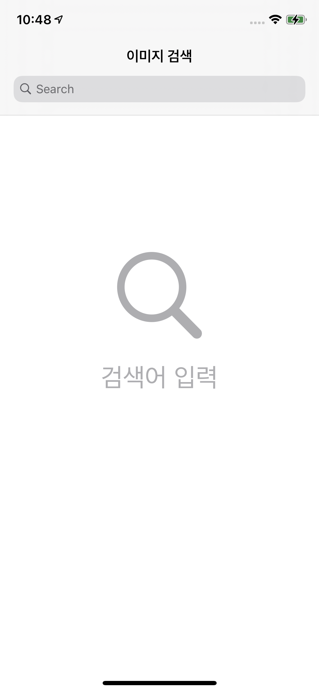
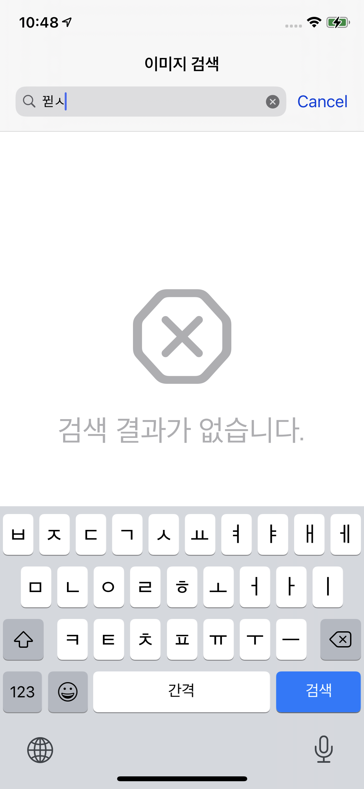
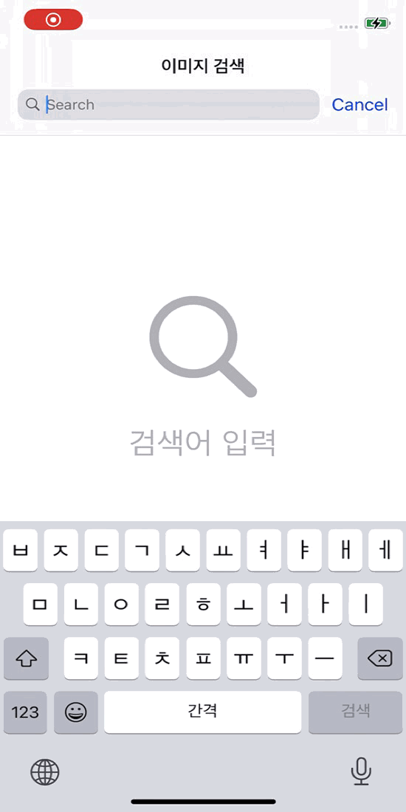

개발 환경
------------
1. Swift 버전
> * 5.2
2. 사용한 라이브러리
> * Alamofire 
> * Toast-Swift
> * RxSwift
> * RxCocoa
> * RxGesture
> * RxOptional
> * Then
> * SwiftLint
> * RxBlocking
> * RxTest
3. 구조
> * MVVM 

기능 설명
------------
### 1. 초기화면

 

### 2. 검색

 

### 3. 페이징

 

### 4. 이미지 상세

 

### 5. 검색실패

 

### 네트워크 & API에러

 

